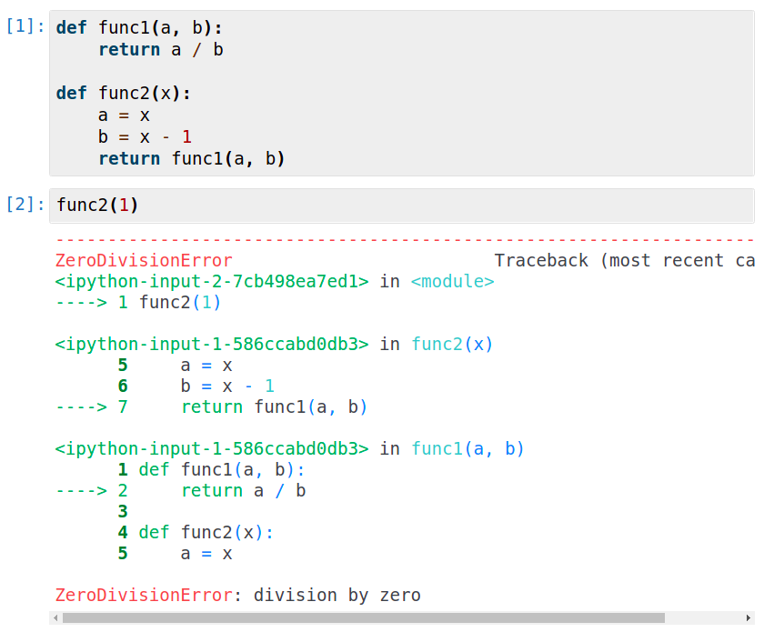
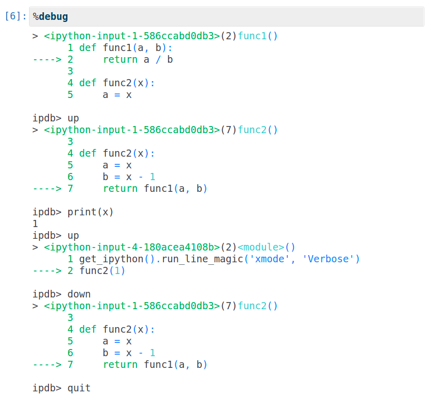

# Jupyter Debugging

This page descrips some debugging ideas for Jupyter Notebooks, i.e. figure out, what went wrong, when you got an error or the code works different than expected.

General recommendiation:
Add many `asserts` and tests to your code, some of them will most likely save you later much time, e.g.:
```python
import numpy as np

def observation_mean(observation_matrix):
    # observation.shape: (sample, feature) 
    assert observation_matrix.ndim == 2, observation_matrix.shape
    # Unlikely that the feature dim has more than 20 features
    assert observation_matrix.shape[1] <= 20, observation_matrix.shape
    return np.mean(observation_matrix, axis=1)

np.testing.assert_allclose(observation_matrix(np.array([[], []])), 5.)
```
will fail, when you call is with the transposed observation matrix as input, which can easily happen (ToDO: Find a better example.).

Images are coppied from: https://jupyter-tutorial.readthedocs.io/de/latest/workspace/ipython/debugging.html

When you program something, it is likely, that the code does different thinks as indepdent.
You will either observe, that the result is wrong or get an [Exception/Error](https://docs.python.org/3/tutorial/errors.html):



Here we want to adress the situation, that you got an [Exception/Error](https://docs.python.org/3/tutorial/errors.html) and you want figure out, what exactly went wrong.

When you got an [Exception/Error](https://docs.python.org/3/tutorial/errors.html), you can type `%debug` in another Jupyter cell and it will open debug console below that cell:



The debug console will be at the position of the last exception and you can inspect the local variables (e.g. `print(a)`) or move in the Traceback `up` and `down` to view the variables in outer functions, see the image above.

Important Commands (For more see https://wangchuan.github.io/coding/2017/07/12/ipdb-cheat-sheet.html or use a search engine):
 - `u`, `up`: Move the Traceback one up.
 - `d`, `down`: Move the Traceback one up.
 - `q`, `quit`, `exit`: Exit the debugger.
 - `p`, `print`: Print
 - `h`, `help`: Open help, e.g. list commands with `h` and the description of one command with `h down`
