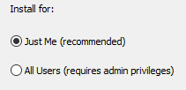

# Installation for Windows

## Anaconda Distribution

1. Download the latest Python 3.X [Anaconda Distribution](https://www.anaconda.com/distribution/). Make sure to select the correct distribution.
2. Double click on the `Anaconda3-XX.exe`. Klick `Next` and `Agree` to the following License Agreement.
3. We recommend to install Anaconda only for the current User (Select `Just me`) 

    This has the advantage that each User can manage their environment individually.
4. The default installation path is `C:\Users\MYUSER\AppData\Local\Continuum\anaconda3`, which is fine. In the Explorer you can navigate to the directory by pasting `%USERPROFILE%\AppData\Local\Continuum\anaconda3` into the Explorer.
5. In the following screen you are prompted whether you want to add Python to your PATH. If this is your first Python installation, we recommend the second option. If you already have a working python installation, choose none of the options.

## Starting Jupyter
**Option 1:**
    Start the Application `Jupyter Notebook` from your Start-Menu. Then open your browser and navigate to `localhost:8888`
    
**Option 2:**
    Press `Windows + R`, type in `Anaconda Promt` and press `ENTER`. Then type in `jupyter notebook` and press `ENTER`. Do not close the window and navigate to `localhost:8888` with your browser.  
    IMPORTANT: Jupyter always starts in the directory of your shell (`pwd`), unless configured otherwise. Make sure you navigate always to the same directory (ideally the one you want to store your notebooks in) before you type in the command. You can change the directory with the `cd` command (e.g: `cd C:\Users\YOURUSER\python\KSS`) and list the contents of a directory with `dir`.

## Optional: IDE
Beside Jupyter Notebooks, there are various Integrated Development Environments Available (IDE) available for Python. While Spyder is a lightweight IDE that comes with Anaconda, we recommend using [Pycharm](https://www.jetbrains.com/pycharm/download/). You can even use Pycharm Professional for free after registering on the website with your university mail.

## Using from PowerShell / Cygwin (WINDOWS)

If you want to use `pip` and `conda` from a proper shell, you have to tell the shells where the programs are located by adding them to your `PATH` Environment variable or using `conda activate`. This can be done in two ways:
1. Manually using adding the `Scripts`, `bin` and main anaconda installation folder to your path (Typically `C:\Users\YOURUSER\AppData\Local\Continuum\anaconda3`). Make sure to restart your shell afterwards.
2. Activating a Conda environment as described [here](https://conda.io/docs/user-guide/tasks/manage-environments.html)

