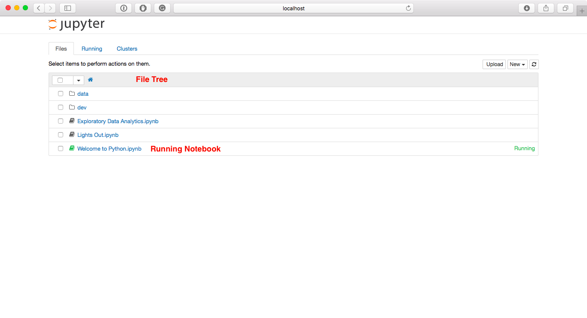

# Jupyter


<sup><sub> https://jupyter.org/</sub></sup>

> The Jupyter Notebook is an open-source web application that allows you to create and share documents that contain live code, equations, visualizations and narrative text. Uses include: data cleaning and transformation, numerical simulation, statistical modeling, data visualization, machine learning, and much more.
> -- https://jupyter.org/

To start a jupyter server, just type the following in a terminal:

```bash
jupyter notebook
```

This should open a new tab in your browser.
You should see the files in the current working directory.

<sup><sub> https://jupyter-notebook.readthedocs.io/en/stable/_images/jupyter-notebook-dashboard.png</sub></sup>

## Shortcuts

- `Tab`: Code completion or indent
- `Shift-Tab`: Tooltip
- `Shift-Tab Shift+Tab`: Long tooltip
- `Ctrl-Enter`: Run selected cells
- `Shift-Enter`: Run cell, select below
- `Alt-Enter`: Run cell and insert below
- `Ctrl-#` (German keyboard) / `Ctrl-/` (English keyboard): Comment
- `Esc a`: New cell above
- `Esc b`: New cell below
- `Esc d d`: Delete current cell
- `Esc m`: Turn current cell into Markdown cell
- `Esc y`: Turn current cell into code cell


## Creating a new notebook document


<sup><sub> https://jupyter-notebook.readthedocs.io/en/stable/notebook.html#introduction </sub></sup>
